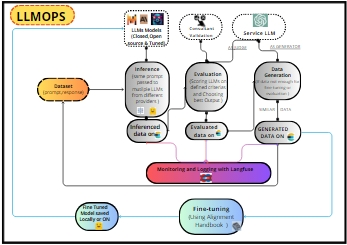
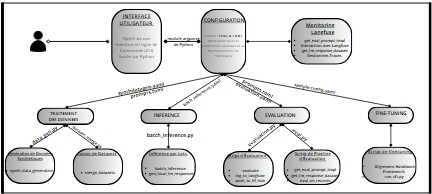

# LLMOPS - Language Model Operations
## Project Overview
LLMOPS is a pipeline designed to handle various stages of large language model (LLM) operations. This includes dataset preparation, inference, evaluation, fine-tuning, and synthetic data generation. The architecture is built to streamline these processes, allowing for more efficient management and deployment of LLMs.
### Key Features:
* `Fine-Tuning`: Adjust LLMs for specific tasks using custom datasets.
* `Dataset Merging`: Combine datasets into a single, unified training or evaluation dataset.
* `Synthetic Data Generation`: Create synthetic data to enhance model training.
* `Batch Inference`: Perform inference on large datasets efficiently.
* `Evaluation`: Measure model performance on predefined criteria.
  
The architecture of this project is represented in the following images:

 

## Installation Requirements
To set up and run this project, the following Python packages are required:
```
python3.12 -m pip install openai==0.28
 python3.12 -m pip install git+https://github.com/huggingface/alignment-handbook.git@main
pip install -U transformers
pip install -U peft
pip install -U accelerate
pip install -U bitsandbytes
pip install -U datasets
pip install time
pip install tqdm
pip install pyyaml
```
Additionally, log into Hugging Face to access open-source models:
``` !huggingface-cli login ```

## Commands to Run Various Stages
### Batch Inference
Perform batch inference over a large dataset using the following command:
```
python batch_inference.py --from-config config/batch_inference.yaml

```
Description: The `batch_inference.py` script processes input data in batches, leveraging the model specified in `batch_inference.yaml`. This allows for efficient handling of large datasets.
### Model Evaluation
To evaluate the performance of the models on specific criteria, use this command:
```
python evaluation.py --from-config config/evaluation.yaml
```
Description: The `evaluation.py` script runs multiple evaluations of the model based on predefined metrics in the `evaluation.yaml` file. The results are then used to optimize the model or compare different models.
### Synthetic Data Generation
Generate synthetic data to augment the training dataset using this command:
``` 
python data_gen.py --from-config config/synthdatagen.yaml
```
Description: The `data_gen.py` script creates synthetic data from prompts specified in the `synthdatagen.yaml` file, which can be used to diversify the model’s training data or test its robustness.

### Fine-Tuning with Hugging Face

To fine-tune models using the Hugging Face `alignment-handbook`, clone the repository and copy your configuration:
```
# Clone the repository
git clone https://github.com/huggingface/alignment-handbook.git

# Create custom config directory and copy the configuration file of the model you want to fine-tune
mkdir -p alignment-handbook/recipes/custom/
cp "/home/devadmin/LLMOPS/config/sample_config.yaml" alignment-handbook/recipes/custom/config.yaml

# Navigate to the repository directory
cd alignment-handbook

# Install the required packages
python -m pip install .

# Install Accelerate and other dependencies
pip install accelerate
```
To launch the training using `accelerate`, run the following command:
```
accelerate launch --config_file recipes/accelerate_configs/multi_gpu.yaml --num_processes=1 scripts/run_sft.py recipes/custom/config.yaml

```
### Monitoring and Logging
All model training, evaluation, and inference operations are monitored and logged using ``Langfuse``. Langfuse provides real-time insights into the performance of your models.


